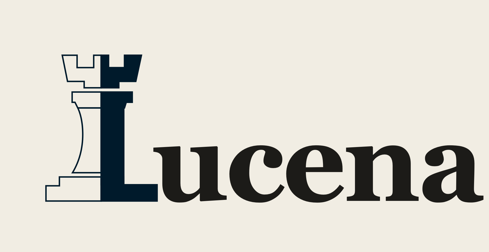

<p align="left">
  
</p>

# lucena

Private superrepo. Pins each layer to a specific commit via submodules — clone this one thing and get
the whole system, reproducibly.

```
lucena/            this repo (private) — pins each layer's commit + shared ops/docs
├── engine/        → lucena-engine   PUBLIC  (AGPL-3.0)
├── backend/       → lucena-backend  PRIVATE
└── mac-client/    → lucena-mac      PRIVATE
```

## Clone
```
git clone --recursive git@github.com:distressedrook/lucena.git
```
Already cloned without `--recursive`? `git submodule update --init --recursive`.

See [MULTIREPO.md](MULTIREPO.md) for the day-to-day workflow (committing a layer, bumping its pointer,
the open/closed AGPL boundary, and the `distressedrook` push identity).
